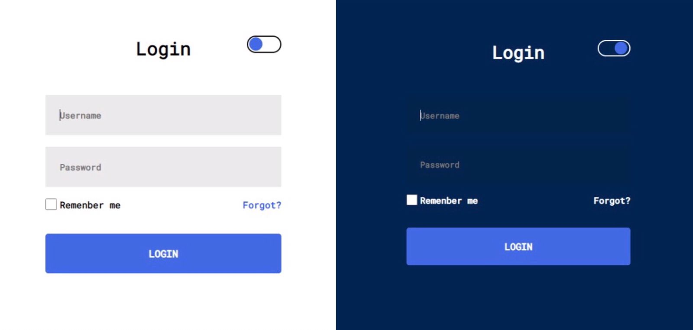

# 👨‍💻 LINK PARA ACESSAR A PAGINA WEB 👇

<a href="https://cezardev07.github.io/form_js/">Link Formulario</a>

ou você pode clicar na imagem e será direcionado para a pagina web (Formulario)

 

 

# <h2> Esse Projeto foi criado para fins didatico com a intenção em estudar JS👨‍💻</h2>

 
<h2>⚙️ Tecnologias usadas nesse projeto ⚙️<h2>
<ul>
    <li>
Html5
</li>
    <li>
Css3
</li>
    <li>
JavaScript
</li>
</ul>

<h2>🔗 E-mail e Senha do Formulario</h2> 

<ol>
    <li>
<strong>Email:</strong> usuario@gmail.com
</li>
    <li>
<strong>Senha:</strong> 123
</li>
</ol>